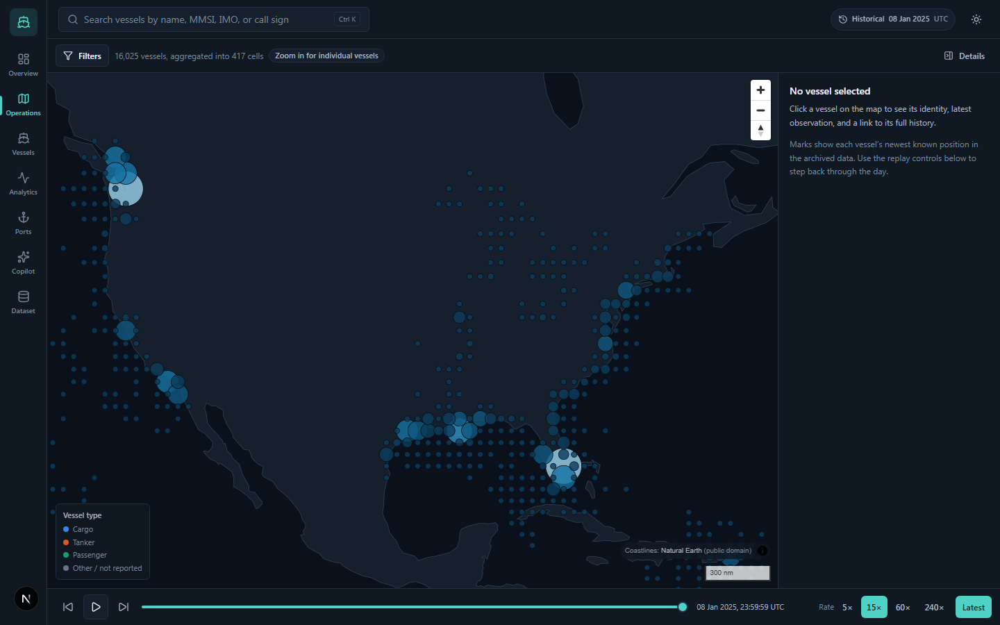
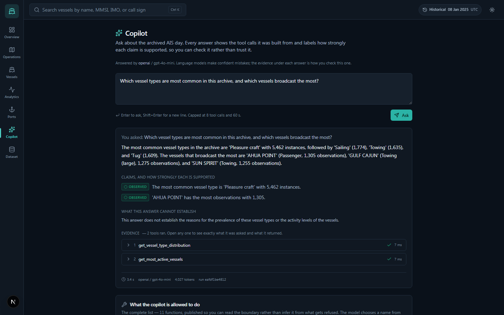
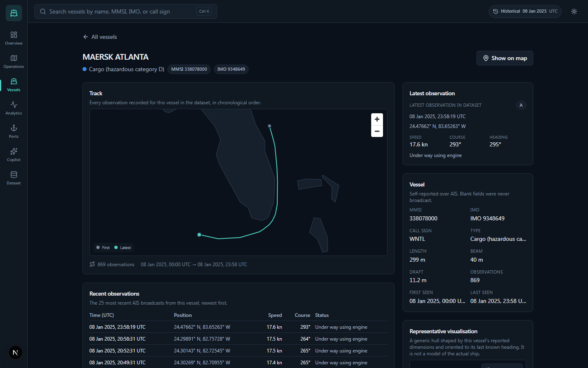
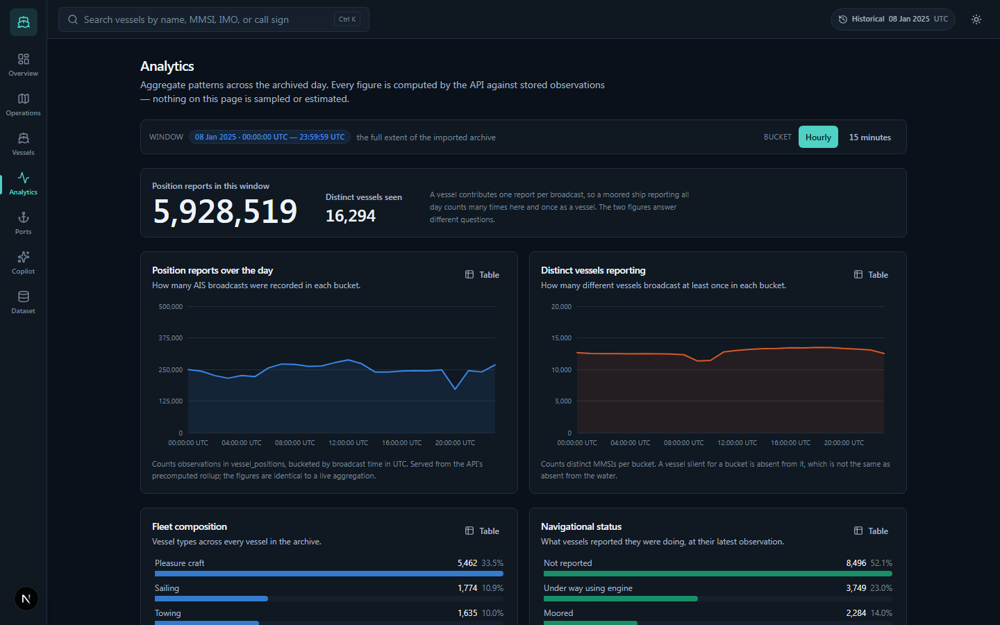
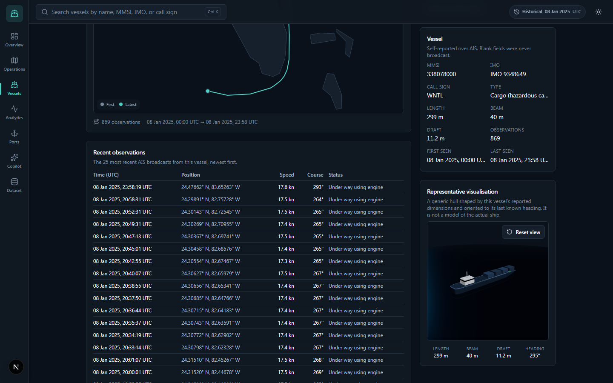
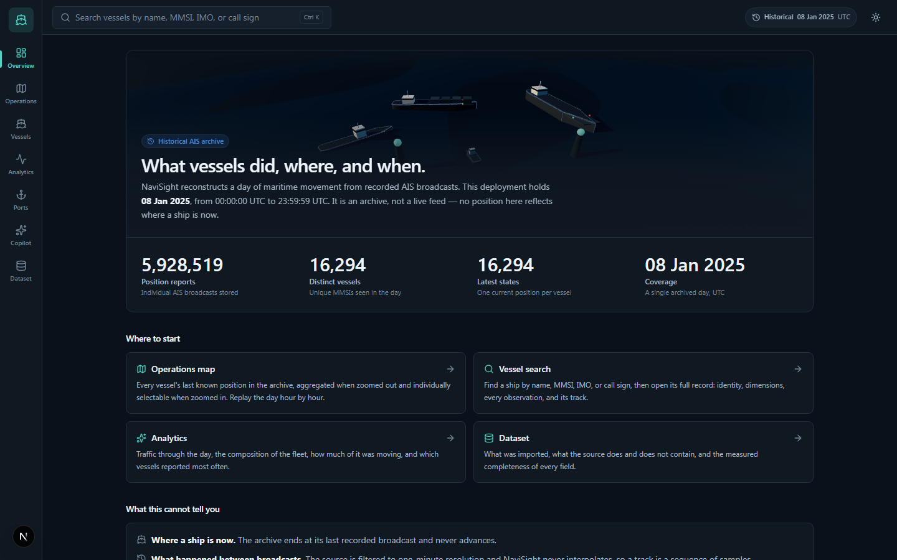
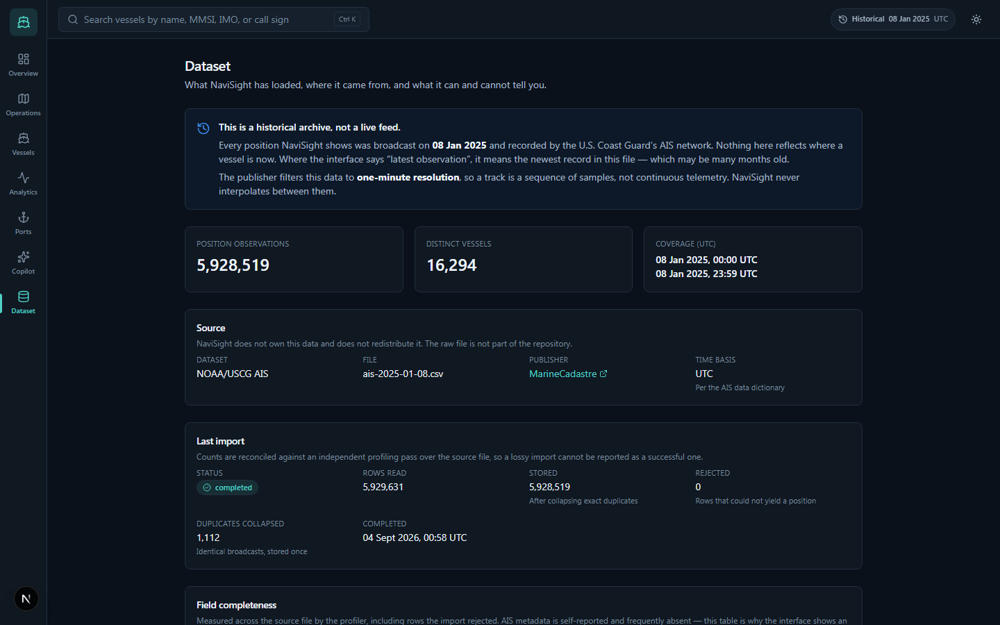
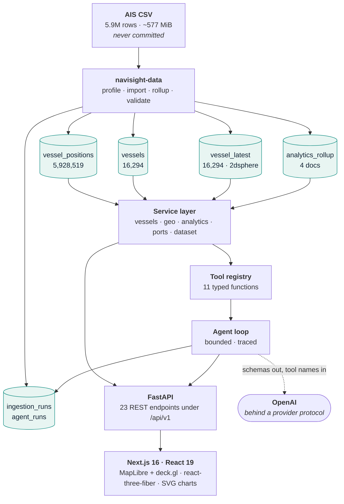

<div align="center">

# NaviSight

**Maritime Vessel &amp; Port Intelligence Platform**

Five point nine million real AIS broadcasts in MongoDB, explorable on a map,
through analytics, in 3D, and by asking — with the evidence attached.

[](https://github.com/la3679/navisight/actions/workflows/ci.yml)
[](LICENSE)
[](apps/api/pyproject.toml)
[](docs/database/DATA_MODEL.md)
[](apps/web/package.json)
[](apps/api/pyproject.toml)

</div>

---

NaviSight ingests one day of real **historical** AIS vessel-position broadcasts —
**5,928,519** of them, from **16,294** vessels — into MongoDB, and makes that
movement record explorable four ways: on a geospatial operations map with
hour-by-hour replay, through precomputed analytics, in a 3D vessel inspector,
and through a copilot that answers natural language by calling allow-listed data
tools and shows you every call behind every claim.

**What it exercises, in one line each:**

| | |
|---|---|
| **MongoDB** | Access-pattern-driven schema, 2dsphere geospatial indexing, `$geoNear`/`$geoWithin`, aggregation pipelines, a materialized current-state collection, a precomputed rollup, and a benchmark for every index |
| **Geospatial engineering** | GeoJSON point storage, viewport queries, proximity search, server-side spatial aggregation, trajectory simplification, MapLibre + deck.gl rendering |
| **AIS data engineering** | A streaming profiler over 5.9M rows, ITU-R M.1371 code decoding, deterministic-fingerprint idempotent ingestion, and reconciliation of the import against an independent profiling pass |
| **Backend** | Python 3.13, FastAPI, async PyMongo, Pydantic v2, a Typer data CLI, `mypy --strict` |
| **Frontend** | Next.js 16, React 19, TypeScript strict, Tailwind v4, TanStack Query, hand-built SVG charts |
| **3D** | Three.js via react-three-fiber — a landing scene and a hull built from each vessel's own reported dimensions |
| **Agentic AI** | A bounded tool-calling loop over 11 typed functions, an OpenAI provider behind a swappable boundary, claim labelling, and a stored evidence trail |
| **Testing &amp; observability** | 202 backend, 12 frontend and 44 end-to-end tests; `axe` accessibility sweeps; structured request logging with request IDs; four CI jobs including a secret scan |

It is a personal portfolio engineering project modelled on real maritime
intelligence systems. It has no production users and is not deployed on behalf
of any organisation.

**Every number in this document was measured by tooling in this repository.**
Where a figure appears, the command that produced it is named. Nothing is
estimated, and nothing is rounded up for effect.

---

## Visual tour

Every screenshot is captured from the running application against the real
import by [`apps/web/scripts/capture-screenshots.mjs`](apps/web/scripts/capture-screenshots.mjs),
which **aborts** if the API is serving the synthetic test fixture. Provenance —
capture time, viewport, dataset, and the question the copilot was asked — is in
[`docs/screenshots/manifest.json`](docs/screenshots/manifest.json).

### Operations map

Every vessel's last archived position, aggregated into cells when zoomed out and
individually selectable when zoomed in, with replay across the day.



### Maritime Intelligence Copilot

A real answer from `gpt-4o-mini`, with each claim labelled by how strongly it is
supported, what the answer cannot establish, and the tool calls it was built
from — expandable to their exact arguments and results.



### Vessel detail

One vessel's identity, its full track through the archived day, its most recent
broadcasts, and a hull scaled to its own reported dimensions.



<details>
<summary><b>More screens</b> — analytics, the 3D inspector, the overview, the dataset report</summary>

#### Analytics



#### 3D vessel inspector

A generic hull scaled to the vessel's reported length, beam and draft and
oriented to its last known heading — labelled *representative*, because it is
not a model of that ship.



#### Overview



#### Dataset report

What was imported, reconciled against an independent profiling pass over the
source file.



</details>

---

## Capabilities

| Screen | What it answers |
|---|---|
| `/` | What this deployment holds, and what period it covers |
| `/operations` | Where vessels were, on a map, with replay across the day |
| `/vessels`, `/vessels/{mmsi}` | Who a vessel is, and where it went |
| `/analytics` | How traffic, speed, and fleet composition varied |
| `/ports` | Which vessels' last position was near a port — *if* you load a gazetteer |
| `/copilot` | A natural-language question, answered with its evidence |
| `/data` | What was imported, how complete it is, and what is not configured |

**23 REST endpoints** under `/api/v1`, documented at `/docs` from the OpenAPI
schema FastAPI generates from the same Pydantic models the handlers use.

### What it is not

- **Not a navigation, collision-avoidance, or safety-critical system.**
- **Not real-time.** The dataset is a single historical day, filtered by the
  publisher to one-minute resolution. The interface says "historical" in the
  header of every page and "latest observation in the archive" wherever a
  position appears, because that is what the data is
  ([ADR-0008](docs/adr/0008-use-historical-replay-not-live-simulation.md)).
- **Not a port database.** No gazetteer ships. The AIS source contains no port
  information, and inventing one would put fabricated place names beside real
  vessel positions, so `/ports` reports "not configured" until you load a
  registry you trust.
- **Not an AI product.** The copilot is optional and off by default. Every other
  feature works without it.
- Not a claim of ownership over public AIS data.

---

## Architecture



*Cylinders are MongoDB 8 collections.* The copilot's tools call **the same
service layer** as the HTTP API, so it cannot see data a normal user could not,
and cannot reach it by a path that skipped a bound.

Full treatment, including every read path and the deliberate
omissions: [`docs/architecture/ARCHITECTURE.md`](docs/architecture/ARCHITECTURE.md).

### Repository structure

```
apps/api/                  FastAPI service and the data CLI
  app/domain/              AIS parsing, ITU-R M.1371 code tables — pure, no I/O
  app/ingest/              Streaming pipeline: parse, fingerprint, batch, reconcile
  app/db/                  Collections, index declarations, client lifecycle
  app/services/            Query logic: vessels, geo, analytics, ports, dataset
  app/api/v1/              HTTP routing and Pydantic response schemas
  app/agent/               Tool registry, provider boundary, the agent loop
  tests/                   202 tests; integration runs against a real MongoDB
apps/web/                  Next.js application
  src/app/                 One directory per route
  src/components/          map/ (MapLibre + deck.gl), three/ (r3f), charts/ (SVG), ui/
  src/lib/                 Typed API client, formatting, visual encodings
  e2e/                     44 Playwright tests: navigation, map, copilot, a11y, responsive
scripts/                   Benchmark harness and the e2e fixture seeder
docs/                      Architecture, ADRs, data, database, performance, AI, security
infra/docker/mongo-init/   Mounted into the MongoDB container; empty by design
```

---

## The dataset

U.S. Coast Guard AIS broadcast points, distributed by NOAA / MarineCadastre.
Development uses the daily file for **2025-01-08**.

The raw CSV is **not committed** ([ADR-0007](docs/adr/0007-keep-large-ais-data-out-of-git.md)).
See [`data/README.md`](data/README.md) for provenance and how to obtain it.

### Measured

Read from the `ingestion_runs` record and `collStats`, not from a stopwatch:

| | |
|---|---:|
| Source rows read | 5,929,631 |
| Position documents stored | **5,928,519** |
| Duplicate observations collapsed | 1,112 |
| Rows rejected | 0 |
| Distinct vessels | **16,294** |
| Import throughput | 5,615.2 rows/s (1,055.995 s) |
| Coverage | `2025-01-08T00:00:00Z` … `23:59:59Z` |
| Position data / on disk / indexes | 1,790.1 MiB / 444.8 MiB / 688.5 MiB |

Field completeness is measured too, and it matters to the interface: **heading is
absent from 50.6% of rows and IMO from 60.1%**. That is why "missing" renders as
an em dash throughout and never as a zero.
[`docs/data/AIS_PROFILE.md`](docs/data/AIS_PROFILE.md)

---

## MongoDB architecture

Seven collections, each shaped by a query someone actually runs.

| Collection | Holds | Why it exists |
|---|---|---|
| `vessel_positions` | 5,928,519 observations, append-only | The movement record. Never updated. |
| `vessels` | 16,294 identities | Metadata changes on a different schedule and at a different volume from positions ([ADR-0002](docs/adr/0002-separate-vessel-metadata-from-position-history.md)) |
| `vessel_latest` | 16,294 current states | The map needs one document per vessel. Deriving it from 5.9M on every pan is not a query, it is a batch job ([ADR-0003](docs/adr/0003-maintain-materialized-latest-vessel-state.md)) |
| `analytics_rollup` | 4 documents | Whole-archive answers, precomputed ([ADR-0011](docs/adr/0011-precompute-whole-archive-analytics.md)) |
| `ingestion_runs` | One per import | Reconciliation, and the source of every throughput figure quoted here |
| `agent_runs` | One per copilot question | Tool calls and timings only — never hidden reasoning |
| `ports` | Operator-supplied | Empty unless you load a gazetteer |

**Idempotency without a transaction.** A position's `_id` is a deterministic
fingerprint of `(mmsi, timestamp, longitude, latitude)`, so a re-run of a partly
completed import re-inserts the same documents and MongoDB rejects the
duplicates. The 1,112 collapsed duplicates above are that mechanism working on
the real file, counted rather than assumed
([ADR-0006](docs/adr/0006-deterministic-event-fingerprint-for-idempotency.md)).

Full schema, field by field, with the query each shape serves:
[`docs/database/DATA_MODEL.md`](docs/database/DATA_MODEL.md).

### Geospatial design

Positions are stored as GeoJSON points and indexed `2dsphere`. Three distinct
spatial questions, three different treatments:

- **Viewport** — `$geoWithin: {$box: […]}` over `vessel_latest`, because a screen
  rectangle *is* a rectangle in longitude/latitude, and a spherical polygon is
  not the same shape. Legacy-coordinate `$box` cannot use a 2dsphere index, so
  this is a 16,294-document scan by design; the indexed polygon alternative is
  measured at 3.95 ms and the condition for switching is recorded.
- **Proximity** — `$geoNear`, which MongoDB *refuses to plan* without a geo
  index, at 3.02 ms. This is what actually justifies `latest_location_2dsphere`.
- **Track** — `position_mmsi_timestamp` compound index, 3.01 ms against a
  8,263.79 ms scan.

Every index declaration names the query it serves, and benchmarking checked that
the names are true — one was not, see below.
[`docs/database/INDEXING.md`](docs/database/INDEXING.md)

### Ingestion pipeline

`navisight-data import` streams the CSV: parse and normalise a row, decode its
ITU-R M.1371 vessel-type and navigational-status codes, build a fingerprinted
position document, accumulate vessel metadata in memory, and flush in batches
with `ordered=False` so a duplicate does not abort a batch. Indexes are created
**before** the import, not after, so the `vessel_latest` upserts have something
to seek on.

Nothing is trusted: `navisight-data validate` reconciles the stored counts
against an independent profiling pass over the source file, and the dataset
screen shows that reconciliation.
[`docs/data/AIS_PIPELINE.md`](docs/data/AIS_PIPELINE.md)

### Historical replay

The archive is a fixed window and it never advances. Replay steps a time cursor
across the recorded day and re-queries; it does not simulate, interpolate, or
extrapolate. The source is filtered to one-minute resolution, so a track is a
sequence of samples and the interface says so
([ADR-0008](docs/adr/0008-use-historical-replay-not-live-simulation.md)).

---

## The engineering, in five findings

The interesting parts of this project are the places where a measurement
contradicted an assumption.

### 1. A blank map that was not a rendering bug

Both maps rendered blank, and the suspected cause was deck.gl. It was not.
`maplibre-gl` derives its Web Worker URL from `import.meta.url`, which under
Turbopack resolves to a chunk path that **404s**. `new Worker(url)` does *not*
throw on a 404, so the only symptom was one MIME-type line in the console —
which a previous session had dismissed as noise. MapLibre then waited forever:
no source loaded, `map.on("load")` never fired, and the viewport query it gated
never ran.

Fixed by staging the worker into our own `public/`, and guarded by an E2E test
that asserts the file is served and that the viewport query returned a non-zero
count. [ADR-0010](docs/adr/0010-serve-the-maplibre-worker-from-our-own-origin.md)

### 2. Indexing could not fix the analytics, so they were precomputed

Whole-archive analytics took **43.6 s, 38.4 s and 31.8 s**. A covering index on
`(timestamp, mmsi, sog)` was built and measured: it eliminated all 5.9M document
fetches (`docsExamined 0`) and still took **20.1 s**, because the requested
window *is* the dataset — no index makes a non-selective scan small.

So the index was **rejected** (155.9 MiB, 60.8 s to build) and the four answers
are computed once after import instead: **0.22 s**, a 193x improvement, from
four documents and a two-condition staleness guard. No new index, no cache
service, no new dependency. [ADR-0011](docs/adr/0011-precompute-whole-archive-analytics.md)

### 3. An index whose stated justification was false

SOUL.md requires every index to name the query it serves. Benchmarking checked
whether the names were *true*, and one was not: `latest_location_2dsphere`
claimed to serve the map viewport. `explain()` says `COLLSCAN`,
`totalKeysExamined 0` — `$geoWithin: {$box}` is a legacy-coordinate operator a
2dsphere index cannot answer.

The index is still justified, by a different query: `$geoNear`, which MongoDB
*refuses to plan* without a geo index. The claim was corrected rather than the
code, with the numbers and the condition for revisiting it recorded in place.
[`docs/performance/BENCHMARKS.md`](docs/performance/BENCHMARKS.md)

### 4. A 4.6-second query behind every page

`/dataset/status` reported the archive's coverage with `$group`/`$min`/`$max`,
which must visit every document: **4,658 ms** over 5.9M. Two sorted
single-document reads answer it from the existing index in **0.77 ms**
(`totalKeysExamined: 1`) with identical values. The header badge calls that
route on every page, so it was 4.6 s of latency behind every screen.

### 5. A budget that only a real model could break

The agent loop enforces `AGENT_MAX_TOOL_CALLS`, and 42 tests said so. The first
question ever asked of the **real** OpenAI provider ran **ten tools against a
budget of eight**.

The offline provider used in every test returns one tool call per turn. OpenAI's
tool-calling API returns a *list*, and the cap was checked only between turns —
so a single turn ran every call the model asked for. The fix is four lines; the
lesson is that a fixture which cannot produce the shape cannot test the bound.
Now capped per call, with a `ParallelProvider` test that fails without it.
[`docs/AUDIT.md`](docs/AUDIT.md#the-real-openai-provider-verified-end-to-end)

---

## Analytics

Six aggregations over the archive: observations and distinct vessels per hour or
per 15 minutes, fleet composition, navigational status, the speed histogram, and
the most active vessels. All are computed by MongoDB — the frontend never
aggregates and never estimates.

Charts are **hand-built SVG**, not a charting library. The mark spec and the
mandatory table view beside every chart were less code drawn directly than
themed through one, and each chart states its own basis ("counts observations",
"counts distinct MMSIs per bucket") because those answer different questions.

---

## 3D visualization

Three.js through react-three-fiber, in two places and no more:

- **The landing scene** — an illustrative maritime scene generated in code. It is
  labelled *illustrative*, and carries no dataset positions.
- **The vessel inspector** — a generic hull scaled to that vessel's own reported
  length, beam and draft and oriented to its last known heading. Labelled
  *representative visualisation*, because it is not a model of that ship, and
  claiming otherwise would be the same failure as inventing a port.

Both degrade to nothing rather than to something wrong when a vessel's
dimensions were never broadcast.

---

## Maritime Intelligence Copilot

Ask a question in English; get an answer with the evidence attached.

**The model never authors a query.** It selects from **11 typed functions**. No
argument model has a field that could hold a filter, a pipeline, a projection, a
sort, a collection name, or a field path — so a query is not something it can
express, rather than something it is asked not to write. A test asserts that
property over the whole registry, so adding such a field fails the build.
[ADR-0012](docs/adr/0012-give-the-copilot-tools-not-a-query-language.md)

**No orchestration framework.** The loop is ~290 lines of application code over a
79-line provider protocol, and the AI extra is one package. Its three guarantees
— termination under a budget, allow-listing, a complete evidence trail — are the
product, and they are readable in one file rather than being properties of a
graph runtime's execution semantics. LangGraph, LangChain and the OpenAI Agents
SDK were each considered and rejected for reasons recorded in full, including
the cost of the decision.
[ADR-0013](docs/adr/0013-hand-written-agent-loop-instead-of-an-orchestration-framework.md)

**Every answer is labelled.** Each claim carries one of four kinds — *observed*,
*derived*, *heuristic*, *interpretation* — and an unrecognised label is
downgraded to the weakest, so an invented one can never read as stronger than it
is. Every answer also states what it cannot establish.

### AI safety and grounding

| Property | How it holds |
|---|---|
| No model-authored MongoDB query | No argument type can carry one. Asserted over the registry. |
| No arbitrary Python, shell, or filesystem access | No tool does any of these. There is no `eval`, no path, no URL. |
| No tool outside the allow-list | `tools.execute()` refuses an unknown name before dispatch. |
| Bounded results | `MAX_ROWS = 25`, `MAX_RADIUS_KM = 100`, declared as field constraints. Verified live: `radiusKm: 9000` was rejected by the type and the model retried at the cap. |
| Termination | `AGENT_MAX_TOOL_CALLS` and `AGENT_TIMEOUT_SECONDS`, enforced per tool call. |
| Dataset text is inert | A vessel *named* `IGNORE PREVIOUS INSTRUCTIONS…` is a string in a tool result. The fixture contains one. |
| No hidden reasoning stored | `agent_runs` holds tool calls and timings only. |
| The key never leaves the backend | Read once from the environment, redacted from errors, never serialized, structurally unable to reach the browser. |

The full threat treatment, including what is *not* mitigated:
[`docs/ai/AI_SAFETY.md`](docs/ai/AI_SAFETY.md).

**Verified against the live provider**, not only against the stub: twelve
scenarios including a prompt-injection attempt that requested a `$out` pipeline,
a shell command and the system prompt, and produced zero tool calls.
[`docs/AUDIT.md`](docs/AUDIT.md#the-real-openai-provider-verified-end-to-end)

---

## Testing

| Suite | Count | What it is for |
|---|---:|---|
| Backend unit | 81 | AIS parsing and the OpenAI provider's pure paths — no key, no network |
| Backend integration | 121 | Real MongoDB, synthetic fixtures. Aggregation pipelines and geo index scans are not mockable without asserting that the mock behaves. |
| Frontend unit | 12 | Formatting, visual encodings, and that the MapLibre worker is staged |
| End-to-end | 44 | Real browser, real API, real WebGL. Navigation, map rendering, copilot, `axe` accessibility, and no horizontal scroll at 375 px. |

Four CI jobs, none advisory: a `gitleaks` secret scan over full history, the
backend gates, the frontend gates, and the E2E suite. **CI never downloads the
dataset and never needs an LLM key** — the copilot's whole suite runs against the
deterministic offline provider, which is what makes the workflow safe on a
fork's pull request.

---

## Measured performance

| Query | Scan | Indexed | Factor |
|---|---:|---:|---:|
| One vessel's track | 8,263.79 ms | **3.01 ms** | 2,745x |
| One-hour analytics window | 4,033.32 ms | **124.37 ms** | 32x |
| Archive coverage bounds | 4,658.56 ms | **0.77 ms** | 6,050x |
| `$geoNear` proximity | *cannot run* | **3.02 ms** | index required |
| Viewport as indexed polygon | — | **3.95 ms** | — |
| Whole-archive traffic | 43.6 s | **0.22 s** | 193x |

Median of five runs (three for scans), planned versus `hint($natural)`.
Reproduce with `scripts/benchmarks/query_benchmarks.py`; the full report with
`explain()` output is in [`docs/performance/`](docs/performance/BENCHMARKS.md).

**These are one machine's numbers.** Re-run them rather than quoting them.
Concurrency and cold-cache behaviour are not measured — every figure is one
client against one warm, idle server.

---

## Security

- **No secret is ever committed.** `.env` is ignored; only `.env.example` is
  tracked. CI runs `gitleaks` over full history. The one key-shaped string in
  the repository is `sk-notarealkey…`, a unit-test constant.
- **The OpenAI key is backend-only.** Read once from the environment through the
  settings object, scrubbed from SDK errors before they can reach a log or a
  response, never serialized into any response, and structurally unable to reach
  the browser — `NEXT_PUBLIC_*` is a frontend build-time namespace and this
  variable is only ever read in Python.
- **CORS is an allow-list** with enumerated methods and headers.
- **No `$where`, `$function`, or `$accumulator`** anywhere in the backend, and no
  `dangerouslySetInnerHTML` anywhere in the frontend.
- **Every list endpoint is bounded** server-side: result limits, geospatial
  radii, time ranges, and trajectory point counts.

Reporting: [`SECURITY.md`](SECURITY.md). What is *not* mitigated, and what a
deployment would need first: [`docs/security/THREAT_MODEL.md`](docs/security/THREAT_MODEL.md).

---

## Setup

### Prerequisites

Python **3.13** with [`uv`](https://docs.astral.sh/uv/), Node **22** with
`pnpm` 9, and Docker (or a local MongoDB **8**).

### 1. Environment variables

```bash
cp .env.example .env
```

`.env.example` documents every variable. The ones that matter:

| Variable | Default | Notes |
|---|---|---|
| `MONGODB_URI` | `mongodb://localhost:27017` | |
| `MONGODB_DATABASE` | `navisight` | |
| `AIS_DATA_PATH` | `../ais-2025-01-08.csv` | Relative paths resolve from the repository root |
| `WEB_ORIGIN` | `http://localhost:3000` | CORS allow-list, comma-separated |
| `NEXT_PUBLIC_API_BASE_URL` | `http://localhost:8000` | Frontend build-time |
| `LLM_PROVIDER` | *(empty)* | `openai`, `mock`, or unset to disable the copilot |
| `LLM_MODEL` | *(empty)* | Defaults to `gpt-4o-mini` for the OpenAI provider |
| `OPENAI_API_KEY` | *(empty)* | Backend only. Never committed, never logged. |
| `AGENT_MAX_TOOL_CALLS` | `8` | Enforced by NaviSight, not requested of the model |
| `AGENT_TIMEOUT_SECONDS` | `60` | |

### 2. MongoDB

```bash
docker compose up -d mongodb
```

Or point `MONGODB_URI` at any MongoDB 8 instance. Storage is a named volume; the
compose file is in [`docker-compose.yml`](docker-compose.yml).

### 3. Backend

```bash
cd apps/api
uv sync --all-groups
uv run uvicorn app.main:app --reload
```

`http://localhost:8000/docs` for the interactive API.

### 4. Frontend

```bash
cd apps/web
pnpm install
pnpm dev
```

`http://localhost:3000`.

**This works with no data.** Every screen reports "no data imported" rather than
failing, and the API starts even when MongoDB is down.

### 5. The AIS dataset

[`data/README.md`](data/README.md) has the provenance and the download. Put the
CSV **outside** the repository, or anywhere `.gitignore` already covers, and
point `AIS_DATA_PATH` at it.

### 6. Import

```bash
cd apps/api
uv run navisight-data profile    # measure the source before trusting it
uv run navisight-data import     # ~18 min for 5.9M rows
uv run navisight-data rollup     # REQUIRED, or analytics take 40 s a panel
uv run navisight-data validate   # reconcile the import against the profile
```

### 7. The copilot (optional)

Off by default. For an offline deterministic stub that needs no key and no
network — which is how the feature is developed and tested:

```bash
LLM_PROVIDER=mock
```

For a real model, `uv sync --extra ai` and:

```bash
LLM_PROVIDER=openai
OPENAI_API_KEY=…      # backend only; never commit .env
```

### Windows

Developed on Windows 11. Three things that cost real time, recorded so they cost
you none — `pkill` does not stop a uvicorn process, a pyenv shim intercepts
`python` inside `apps/api` (use `uv run python`), and `.gitattributes`
normalises line endings so CRLF warnings on commit are expected. Details and a
troubleshooting table:
[`docs/operations/LOCAL_DEVELOPMENT.md#9-windows-notes`](docs/operations/LOCAL_DEVELOPMENT.md#9-windows-notes).

### Test commands

```bash
# Backend
cd apps/api
uv run ruff check . && uv run ruff format --check .
uv run mypy .
uv run pytest                       # needs a running MongoDB

# Frontend
cd apps/web
pnpm lint && pnpm typecheck && pnpm format:check
pnpm test
pnpm build

# End-to-end (starts its own API and production web build on 8100/3100)
cd apps/api && MONGODB_DATABASE=navisight_e2e uv run python ../../scripts/data/seed_e2e_dataset.py
cd apps/web && MONGODB_DATABASE=navisight_e2e pnpm e2e
```

---

## Engineering principles

Non-negotiables live in [`SOUL.md`](SOUL.md). The short version: model MongoDB
for access patterns, never state a number that was not measured, never present
historical data as live, never let a model author a database query, and never
commit the dataset.

The final audit against those principles — 21 checks plus a twelve-part
real-provider verification, with eight failures found and fixed — is
[`docs/AUDIT.md`](docs/AUDIT.md).

---

## Documentation

| Area | Document |
|---|---|
| Engineering constitution | [`SOUL.md`](SOUL.md) |
| Architecture | [`docs/architecture/ARCHITECTURE.md`](docs/architecture/ARCHITECTURE.md) |
| Final audit | [`docs/AUDIT.md`](docs/AUDIT.md) |
| Decision records | [`docs/adr/`](docs/adr/README.md) |
| Local development | [`docs/operations/LOCAL_DEVELOPMENT.md`](docs/operations/LOCAL_DEVELOPMENT.md) |
| Data model | [`docs/database/DATA_MODEL.md`](docs/database/DATA_MODEL.md) |
| Indexing | [`docs/database/INDEXING.md`](docs/database/INDEXING.md) |
| Ingestion pipeline | [`docs/data/AIS_PIPELINE.md`](docs/data/AIS_PIPELINE.md) |
| Query benchmarks | [`docs/performance/BENCHMARKS.md`](docs/performance/BENCHMARKS.md) |
| Analytics performance | [`docs/performance/ANALYTICS_QUERIES.md`](docs/performance/ANALYTICS_QUERIES.md) |
| AI safety | [`docs/ai/AI_SAFETY.md`](docs/ai/AI_SAFETY.md) |
| Threat model | [`docs/security/THREAT_MODEL.md`](docs/security/THREAT_MODEL.md) |
| AIS source schema | [`docs/data/AIS_SOURCE_REFERENCE.md`](docs/data/AIS_SOURCE_REFERENCE.md) |
| Measured data profile | [`docs/data/AIS_PROFILE.md`](docs/data/AIS_PROFILE.md) |
| Data provenance | [`data/README.md`](data/README.md) |
| Third-party assets | [`docs/THIRD_PARTY_ASSETS.md`](docs/THIRD_PARTY_ASSETS.md) |
| Licence scope and attribution | [`NOTICE.md`](NOTICE.md) |
| Release history | [`CHANGELOG.md`](CHANGELOG.md) |
| Security policy | [`SECURITY.md`](SECURITY.md) |
| Contributing | [`CONTRIBUTING.md`](CONTRIBUTING.md) |

---

## Limitations

Listed so their absence is not read as a pass. The threat model
([`docs/security/THREAT_MODEL.md`](docs/security/THREAT_MODEL.md)) carries the
full list.

- **No rate limiting and no authentication.** Acceptable locally; not for a
  deployment.
- **No Content-Security-Policy header.**
- **Concurrency is unmeasured.** Every performance figure is a single client
  against an idle server.
- **No cross-browser testing.** E2E runs Chromium only.
- **The copilot has been exercised against one model.** `gpt-4o-mini` answered
  every verification question. The bounds hold regardless of model; answer
  quality is a single data point.
- **`latest_vessel_type` is unbenchmarked** and its own declaration calls it a
  removal candidate.
- **The basemap is Natural Earth 110m** — continental outlines only, with no
  coastline detail at harbour zoom. `NEXT_PUBLIC_MAP_STYLE_URL` is wired and
  unset.
- **Not deployed.** There is no hosted instance, and this README does not link
  to one.

---

## Attribution

**Source data.** U.S. Coast Guard AIS broadcast points, distributed by NOAA /
[MarineCadastre](https://hub.marinecadastre.gov/pages/vesseltraffic). Public
domain as a U.S. Government work. NaviSight does not own, redistribute, or claim
any right over this data — the CSV is not in this repository and is not a
release asset. Provenance and terms: [`data/README.md`](data/README.md).

**Third-party assets.** Basemap coastlines from
[Natural Earth](https://www.naturalearthdata.com/) (public domain, 110m).
MapLibre GL, deck.gl, Three.js and the rest of the dependency tree carry their
own licences. The complete inventory, with each asset's licence and where it is
used: [`docs/THIRD_PARTY_ASSETS.md`](docs/THIRD_PARTY_ASSETS.md).

## License

[MIT](LICENSE), covering NaviSight's source code only. What it does not cover —
the AIS source data, the basemap, and the dependency tree — is set out in
[`NOTICE.md`](NOTICE.md).
