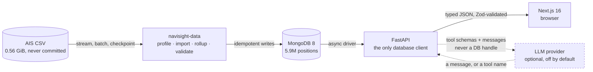
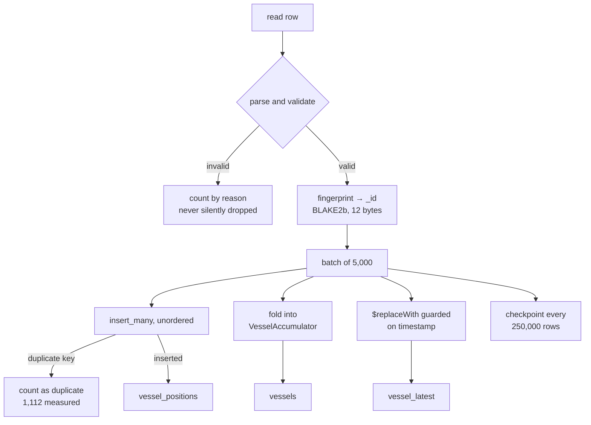
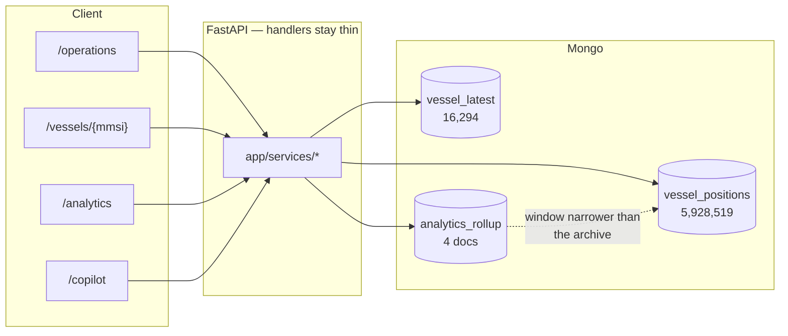
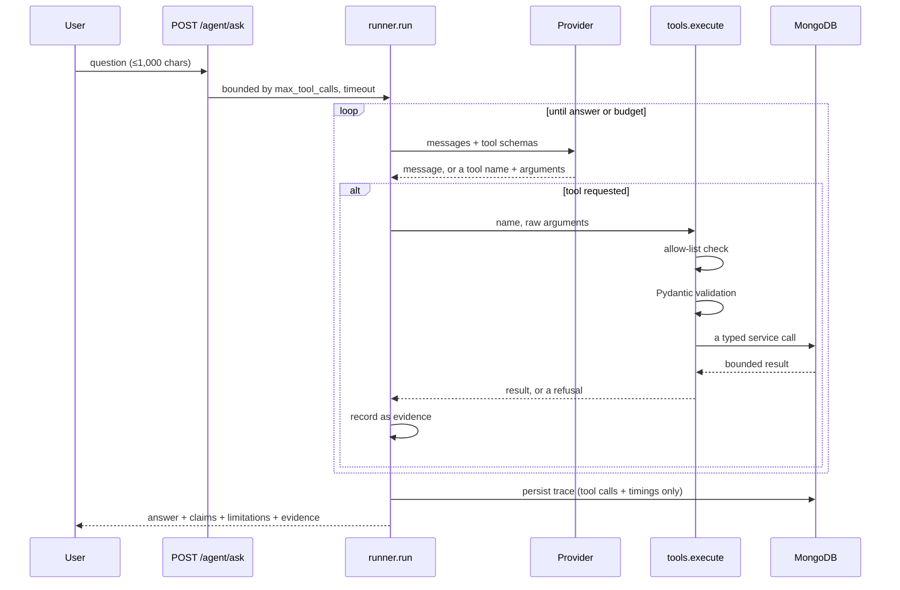
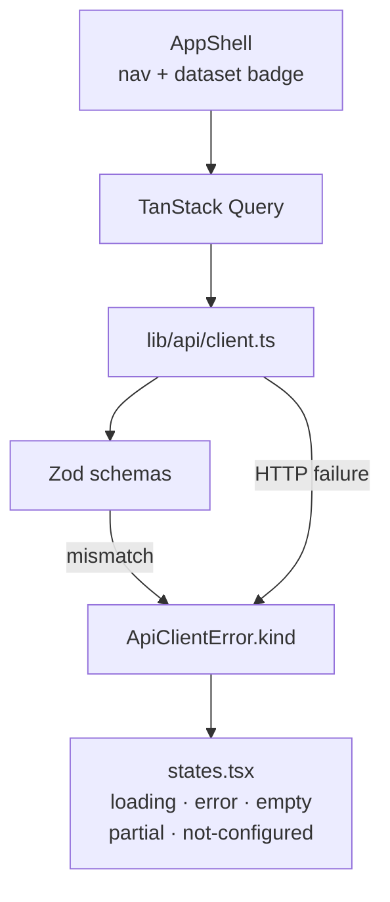

# Architecture

How NaviSight is put together, and which constraint each piece exists to
satisfy.

---

## 1. The whole system

**The browser never reaches MongoDB.** There is no client-side connection
string, and no database credential is ever sent to a browser. The API is the
sole database client, which is what makes every bound in `deps.py` actually
binding.

**The LLM never receives a database handle.** It sees the conversation and the
tool *schemas*, and returns either a message or a request to call a named tool.
The loop decides what happens next.

---

## 2. Ingestion

Four properties, each ruling out a simpler implementation:

| Property | What it rules out |
|---|---|
| **Streaming** | `read_csv()` on a 0.56 GiB file |
| **Idempotent** | a uniqueness index; a "have I seen this?" lookup |
| **Resumable** | starting over after a crash |
| **Observable** | silently discarding malformed rows |

Idempotency and resumability are not independent: a crash between an insert and
its checkpoint is safe **because** the replayed rows collide on `_id` and no-op.

The `vessel_latest` update is the subtle part. **The source file is not
chronologically ordered** — the first 50,000 rows span 00:00 to 18:58 UTC — so
"last write wins" is wrong, and the obvious timestamp-guarded upsert is a trap
that fails with a duplicate key on every stale row. Details in
[`../data/AIS_PIPELINE.md`](../data/AIS_PIPELINE.md).

---

## 3. Read paths

Three decisions visible in that shape:

**The map reads `vessel_latest`, never the history.** 55.06 ms over 16k
documents against 537.60 ms over 5.9M
([ADR-0003](../adr/0003-maintain-materialized-latest-vessel-state.md)).

**Analytics read four precomputed documents.** 0.22 s against 43.6 s. The dotted
edge is the fall-through: a request whose window does not *contain* the archive's
full extent runs the live pipeline instead
([ADR-0011](../adr/0011-precompute-whole-archive-analytics.md)).

**Handlers are thin.** Query logic lives in `app/services/`, so it can be tested
without HTTP *and* reused by the copilot's tools without a round trip back out
through the network. That reuse is why the copilot cannot see data a normal user
could not.

---

## 4. The copilot

The three guarantees, none of which depend on the model cooperating:

1. **It terminates.** The budgets are checked by the loop, not requested of the
   model. Hitting one produces an answer that says so.
2. **Nothing unnamed runs.** `tools.execute` refuses any name outside the
   registry before dispatching.
3. **Every claim is traceable.** Each call is recorded with its validated
   arguments and its result, and returned to the user.

**The model cannot author a query**, because no argument model has a field that
could hold one — a property of the types rather than a check that could be
forgotten ([ADR-0012](../adr/0012-give-the-copilot-tools-not-a-query-language.md),
[`../ai/AI_SAFETY.md`](../ai/AI_SAFETY.md)).

---

## 5. Frontend

**Every response is parsed through a Zod schema**, so a contract change fails at
the boundary with the offending field named, rather than as `undefined`
propagating into a chart three components deep.

**Failures carry a `kind`**, so the UI can tell "the database is down" from
"nothing was found" from "the copilot is not configured" and render the right
state with the right fix. Making each non-success state a component means a
blank panel takes more effort than doing it properly.

**The dataset badge is in the header of every page.** The data is one archived
day and the interface has to say so where the user is looking
([ADR-0008](../adr/0008-use-historical-replay-not-live-simulation.md)).

### Rendering

MapLibre GL draws the basemap; deck.gl mounts as a MapLibre control so both
share **one** canvas and one camera. react-three-fiber renders the decorative
harbour hero, lazy-loaded because three.js is ~600 KB and useless on the server.

MapLibre's Web Worker is served from our own `public/` rather than from the
bundler's chunk path, which 404s under Turbopack — silently, because
`new Worker()` does not throw on a 404
([ADR-0010](../adr/0010-serve-the-maplibre-worker-from-our-own-origin.md)).

Charts are hand-built SVG. The mark spec — 2px lines, rounded data-ends, surface
rings, a crosshair with keyboard parity, and a mandatory table view — was less
code drawn directly than themed through a library.

---

## 6. What is deliberately not here

| Not used | Why |
|---|---|
| Redis / any cache service | The one hot path is served by four precomputed documents. A TTL is the wrong invalidation model for data that changes once, at import. |
| Kafka / a queue | There is no stream. It is an archive. |
| Elasticsearch | Prefix search over 16,294 vessels measures 0.79 ms. |
| A vector database | Nothing does semantic retrieval. |
| An agent framework | The loop is ~150 lines and its guarantees are the point; a graph abstraction would hide them. |
| WebSocket / SSE | Live updates over a recording would be theatre creating a false impression. |
| Third-party map tiles | Avoids a licensing question and a privacy one — no viewer's IP is disclosed to a tile provider. |

Each is absent because nothing demonstrated a need (SOUL.md §5), not because it
was overlooked.

---

## 7. Known architectural limits

- **Single API process, no horizontal scaling story.** Nothing prevents it; it
  simply has not been designed or tested for.
- **No authentication, no rate limiting.** See
  [`../security/THREAT_MODEL.md`](../security/THREAT_MODEL.md).
- **Concurrency unmeasured.** Every performance figure is one client against an
  idle server.
- **The rollup is rebuilt manually.** Coupling it to import was considered and
  deferred; the import is already the longest operation and a resumable job is
  harder to reason about with a 2.6-minute aggregation attached.
- **One MongoDB, no replica set, no sharding.**

---

## See also

- [`../adr/`](../adr/) — the decisions, with their rejected alternatives.
- [`../database/DATA_MODEL.md`](../database/DATA_MODEL.md)
- [`../database/INDEXING.md`](../database/INDEXING.md)
- [`../performance/BENCHMARKS.md`](../performance/BENCHMARKS.md)
- [`../ai/AI_SAFETY.md`](../ai/AI_SAFETY.md)
- [`../security/THREAT_MODEL.md`](../security/THREAT_MODEL.md)
